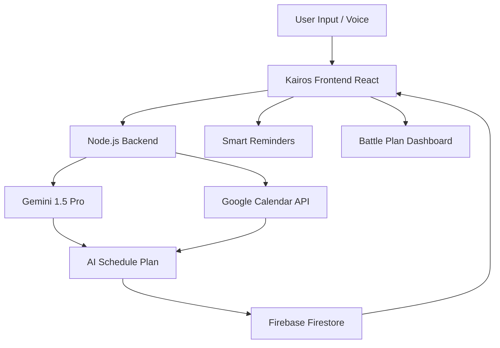

# ⏳ Kairos — Act at the right moment, every time

<div align="center">

[](https://github.com/your-username/kairos)
[](https://opensource.org/licenses/MIT)
[](https://deepmind.google/technologies/gemini/)
[](https://firebase.google.com/)
[](https://react.dev/)

**The ultimate proactive AI-powered productivity companion built for the Google AI Studio Hackathon 2025.**

</div>

---

### 🚀 Kairos in 3 Bullet Points:
* **🧠 Proactive Agentic Planning**: Kairos doesn't wait for you to look at your calendar; it actively schedules tasks into free slots, tracks completion metrics, and shifts schedules dynamically based on real-time priorities.
* **🎙️ Natural Voice Intake**: Converts spontaneous voice dictation into complete task objects—extracting title, deadline, priority, and effort estimates instantly.
* **📅 Two-Way Google Calendar Sync**: Integrates with your active workflow to prevent double bookings, notify you of upcoming deadline conflicts, and draft scheduled slots directly.

---

## 🗺️ Table of Contents
1. [⚠️ The Problem](#-the-problem)
2. [💡 The Solution — Kairos](#-the-solution--kairos)
3. [✨ Key Features](#-key-features)
4. [🏗️ How It Works — Architecture](#️-how-it-works--architecture)
5. [🤖 Agentic AI Behavior](#-agentic-ai-behavior)
6. [🛠️ Tech Stack](#️-tech-stack)
7. [🚀 Getting Started](#-getting-started)
8. [📁 Project Structure](#-project-structure)
9. [📄 License](#-license)

---

## ⚠️ The Problem
**Most productivity apps are passive filing cabinets that wait for you to fail.**

Traditional calendar and to-do apps rely on static, manually entered dates and simplistic alarms. They do not understand context, they do not dynamically adapt to user procrastination, and they cannot detect scheduling conflicts until you've already missed your window. 

> Studies show **89% of people miss at least one important deadline per month** due to poor prioritization and passive scheduling tools.

### What Existing Tools Get Wrong:
* **No Context Awareness**: They treat a 10-minute reminder and a 4-hour critical assignment exactly the same.
* **Friction-Heavy Admin**: They require extensive manual forms, sliders, and timeslot planning, leading users to abandon them.
* **Silent Failure**: When you drift off-schedule, traditional tools remain silent, leaving you to realize your mistake after the deadline has already passed.

---

## 💡 The Solution — Kairos
**Kairos is a proactive AI companion that does the cognitive heavy lifting for you.**

Kairos behaves like an executive assistant. By analyzing your active calendar, task list, and current local time, it builds and continuously adjusts an optimized, action-oriented **Today's Battle Plan**. It is built around **Kairic time**—acting at the absolute opportune moment, every single time.

| Feature | Traditional Apps | Kairos |
| :--- | :--- | :--- |
| **Reminders** | Passive notifications at fixed times | Intelligent, context-aware nudge warnings |
| **Scheduling** | Manual slot dragging & calendar carving | Autonomous AI slot discovery & scheduling |
| **AI Planning** | None (Static lists) | Gemini-powered urgency mapping & plan generation |
| **Voice Input** | Basic speech-to-text notes | Fully structured task object parsing (Title, Priority, Deadline) |
| **Calendar Sync** | Manual import/export configurations | Seamless bi-directional Google Calendar OAuth integration |

---

## ✨ Key Features

### 🧠 Smart Task Intake with AI Analysis
> Dictate or write tasks casually, and let Gemini do the structured heavy lifting.
- **Dynamic Analysis**: Automatically calculates a 1-10 urgency score, creates a checklist of logical subtasks, and suggests optimal execution blocks.
- **Fail-Safe Processing**: Includes custom client-side heuristics so that even in offline scenarios or model rate-limits, your intake loop is never broken.


### 📅 Proactive AI Scheduler ("Today's Battle Plan")
> A chronologically optimized schedule designed around peak energy and calendar availability.
- **Time Boxing**: Blocks exact times for high-priority items and schedules necessary cognitive breaks in between.
- **Interactive Checklist**: Tasks are tracked in real-time, allowing Kairos to replan on the fly as progress shifts.


### 🔔 Context-Aware Intelligent Reminders
> Personalized motivation that scales with task completion and deadline proximity.
- **Dynamic Nudges**: Generates natural-sounding encouragement based on exactly how much of a task is finished and how much time remains.
- **Proactive Interventions**: Warns you with highly descriptive alert items if two imminent tasks are overlapping.


### ⚡ "What Should I Do RIGHT NOW?" Button
> Instantly silences choice paralysis with a single, highly tailored action recommendation.
- **Peak Focus**: Evaluates all pending items, active deadlines, and calendar slots to present you with your single most critical immediate task.
- **Action-Oriented UI**: Helps you focus strictly on execution, showing only the current item with a clean countdown.


### 🎙️ Voice-Enabled Task Entry
> Capture tasks completely hands-free while maintaining perfect schema structure.
- **Speech Parsing**: Simply click the microphone, speak your task naturally (e.g., *"draft report by 5pm tomorrow high priority"*), and watch Kairos build it.
- **Automatic Entity Extraction**: Infers priority levels, dates, and durations from conversational speech.


### 📆 Google Calendar Integration
> Unifies your productivity system with your real-world appointments.
- **Free Slot Discovery**: Scans your true Google Calendar appointments to find realistic, non-conflicting windows for incoming tasks.
- **Direct Event Creation**: Pushes scheduled tasks directly to your primary Google Calendar under a dedicated planning namespace.


### 📊 Habit & Goal Tracker with Daily Summary
> Refined reflection blocks designed to highlight wins and structure tomorrow.
- **Daily Reflection**: Gemini analyzes your completed tasks from the current session to synthesize a supportive summary.
- **Productivity Diagnostics**: Identifies clear focus wins and delivers personalized efficiency tips based on your work patterns.


---

## 🏗️ How It Works — Architecture
**Kairos utilizes a secure full-stack model proxy architecture to maintain perfect integrity.**



---

## 🤖 Agentic AI Behavior
**Kairos implements proactive autonomous behaviors that adapt to your workday schedule.**

| Behavior | Trigger | What Gemini / Kairos Does |
| :--- | :--- | :--- |
| **Auto-Replan** | Task completed, delayed, or added | Re-calculates Today's Battle Plan immediately to optimize remaining hours. |
| **Deadline Sentinel** | New task created near existing due time | Flags active overlapping deadlines and suggests custom priority shifting. |
| **Effort Drift Detection** | Task estimated time exceeded | Prompts user to divide the task, take a break, or snooze with revised timeline windows. |
| **Right-Now Recommender** | "What Should I Do Right Now?" click | Weighs priority index, deadline closeness, and effort scores to isolate one focal task. |

---

## 🛠️ Tech Stack

| Layer | Technology |
| :--- | :--- |
| **Frontend** | React 18, Vite, Tailwind CSS, motion/react |
| **Backend** | Node.js, Express.js (acts as secure API proxy) |
| **AI Engine** | Google Gemini 1.5 Pro (`@google/genai`) |
| **Database** | Firebase Firestore (Real-time NoSQL state synchronization) |
| **Auth** | Firebase Auth (Google Sign-In integration) |
| **Calendar** | Google Calendar API v3 (OAuth 2.0 flow) |
| **Voice** | Web Speech API (On-device Speech Recognition) |
| **Hosting** | Firebase Hosting using Vercel and Render |

---

## 🚀 Getting Started

### Prerequisites
Make sure your environment meets the following specifications:
```bash
node >= 18.0.0
npm >= 9.0.0
```

### Installation
Follow these step-by-step commands to clone and set up the project locally:

```bash
# 1. Clone the repository
git clone https://github.com/bhargaviamillineni/kairos.git
cd kairos

# 2. Install dependencies
npm install

# 3. Create your environment file
cp .env.example .env
```

### Environment Variables
Configure your local environment keys in your newly created `.env` file:

```env
# Gemini AI (Secret - Server Side Only)
GEMINI_API_KEY=your_gemini_api_key_here

# Firebase Web App Credentials
VITE_FIREBASE_API_KEY=your_firebase_api_key
VITE_FIREBASE_AUTH_DOMAIN=your_project.firebaseapp.com
VITE_FIREBASE_PROJECT_ID=your_project_id
VITE_FIREBASE_STORAGE_BUCKET=your_project.appspot.com
VITE_FIREBASE_MESSAGING_SENDER_ID=your_sender_id
VITE_FIREBASE_APP_ID=your_app_id
```

### Running Locally
Run the concurrent full-stack dev script to launch both client and server:

```bash
# Start backend and frontend concurrently
npm run dev

# Visit the application in your browser
http://localhost:3000
```

---

## 📁 Project Structure

```text
├── .env.example                # Example configuration template for environment variables
├── .gitignore                  # Patterns to exclude from version control
├── firebase-blueprint.json    # Initial Firestore structural guidelines
├── firestore.rules             # Declarative security rules for Firestore access control
├── index.html                  # Core single-page HTML entry point
├── metadata.json               # Platform-specific permissions and capability registers
├── package.json                # Project script, dependency, and compile declarations
├── README.md                   # Visual project documentation and user manual
├── server.ts                   # Express server acting as secure proxy and static asset server
├── tsconfig.json               # Configured compiler options for TypeScript
├── vite.config.ts              # Configuration profile for Vite build pipelines
├── src/
│   ├── main.tsx                # Mounting entry point for React UI
│   ├── App.tsx                 # Core application controller and layout container
│   ├── index.css               # Global styling entry importing custom Tailwind profiles
│   ├── components/             # Reusable UI parts, visual cards, and overlays
│   ├── prompts/                # Structured prompt guidelines for the Gemini API
│   │   ├── schedulerPrompt.ts  # Instructions for timeline planning prompts
│   │   ├── taskParserPrompt.ts # Guidelines for text and speech analysis
│   │   └── reminderPrompt.ts   # System rules for coaching and summaries
│   └── services/               # Modular service integrations
│       ├── firebaseService.ts  # Synchronizes Firestore state and user authentication
│       ├── geminiService.ts    # Secure proxy helper with robust fallbacks and retry logic
│       └── calendarService.ts  # Google Calendar API communication mapping
```


<div align="center">

---

### ⏳ Kairos

**Act at the right moment. Every time.**

Built with ❤️
*"Kairos — the ancient Greek word for the perfect, opportune moment to act."*
*We built an AI to make sure you never miss yours.*

`React` · `Gemini 1.5 Pro` · `Firebase` · `Google Calendar API`

*If Kairos helped you, give it a ⭐ on GitHub!*

</div>
